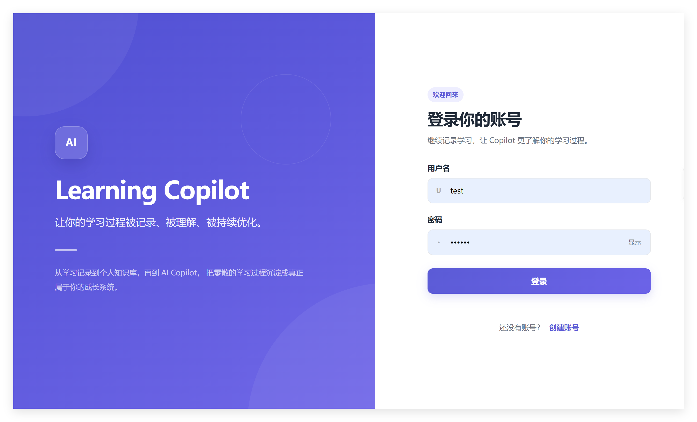
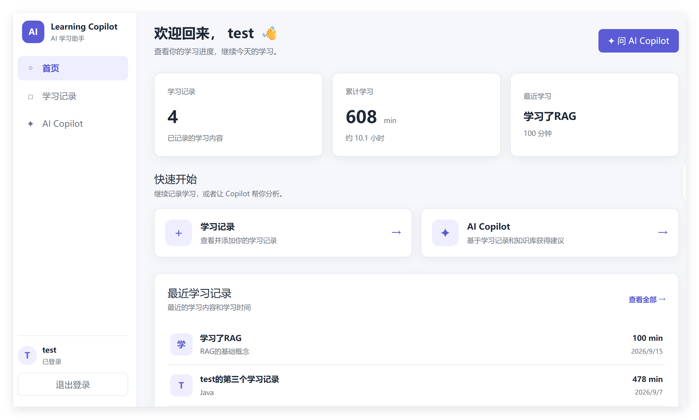
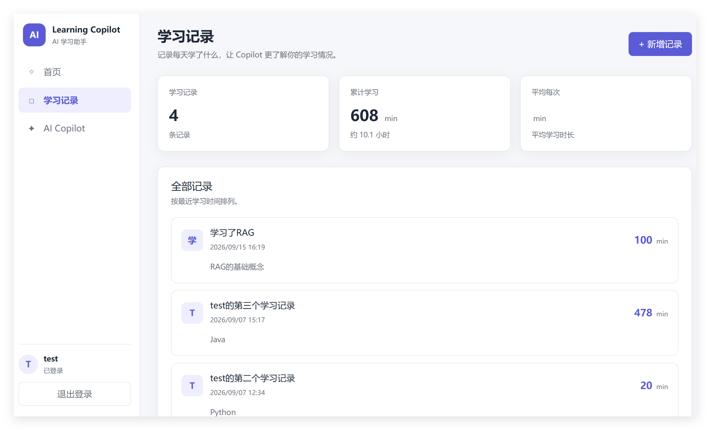
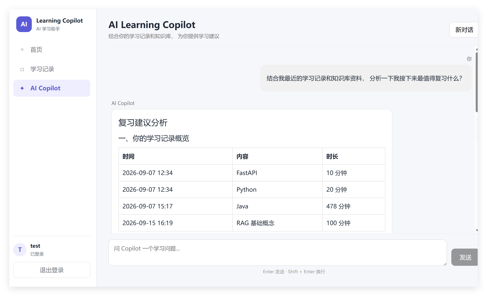
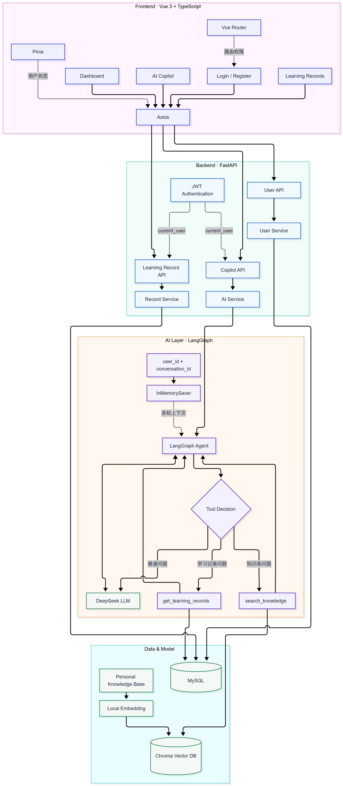
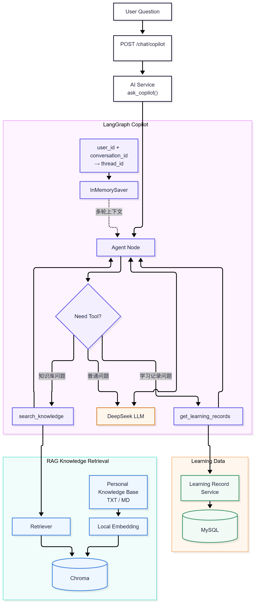

# AI Learning Copilot

> 基于 Vue 3 + FastAPI + LangGraph + RAG 构建的个人 AI 学习助手

AI Learning Copilot 是一个面向个人学习场景的全栈 AI 应用。

项目将 **个人学习记录、RAG 知识库、大语言模型与 LangGraph Agent** 结合，使 AI 不仅能够回答通用问题，还能够读取当前用户的学习历史、检索个人学习资料，并综合这些信息给出个性化学习建议。

---

## 项目展示

| 登录 | Dashboard |
| --- | --- |
|  |  |

| 学习记录 | AI Copilot |
| --- | --- |
|  |  |

---

## 项目简介

普通 AI Chat 通常只能根据当前对话回答问题，并不了解用户长期的学习过程。

例如：

> 我最近主要学了什么？

> 根据我的学习记录和知识库，我下一步最值得复习什么？

普通模型无法直接知道用户以前学过什么，也无法访问用户自己的学习资料。

因此，本项目构建了一个能够结合：

- 用户身份
- 学习记录
- 个人知识库
- 多轮会话上下文
- 大模型通用知识

进行回答的 **AI Learning Copilot**。

最终实现：

```text
用户问题
   ↓
LangGraph Agent
   ↓
判断当前问题需要什么能力
   ↓
┌────────────────┬────────────────────┐
│                │                    │
直接回答      查询个人知识库       查询学习记录
│                │                    │
LLM            RAG Tool          Record Tool
│                │                    │
└────────────────┴────────────────────┘
                 ↓
             综合生成回答
```

---

# 系统架构



系统整体采用前后端分离架构：

- Vue 3 负责用户界面与交互
- FastAPI 提供业务 API
- JWT 负责用户身份认证
- MySQL 保存用户和学习记录
- Chroma 保存个人知识库向量
- LangGraph 负责 Agent 工作流
- DeepSeek 负责模型推理

---

# AI 架构



AI Copilot 的核心不是固定执行某一条 RAG Chain，而是由 LangGraph Agent 根据用户问题自主选择是否调用 Tool。

当前主要包含两个 Tool：

```text
search_knowledge
→ 检索个人知识库

get_learning_records
→ 查询当前用户学习记录
```

因此不同问题会走不同路径：

```text
普通知识问题
→ DeepSeek 直接回答
```

```text
个人知识库问题
→ search_knowledge
→ Retriever
→ Chroma
→ Agent
```

```text
个人学习情况问题
→ get_learning_records
→ MySQL
→ Agent
```

```text
综合分析问题
→ search_knowledge
+
get_learning_records
→ Agent 综合分析
```

---

# 核心功能

## 用户认证

支持：

- 用户注册
- 用户登录
- JWT 身份认证
- 获取当前用户
- 登录状态恢复
- Axios 自动携带 Token
- Token 失效自动跳转登录页
- 登录过期提示
- Vue Router 权限控制
- 多用户数据隔离

受保护接口不会直接相信前端传来的 `user_id`。

后端通过：

```text
JWT
↓
get_current_user
↓
current_user.id
```

识别当前登录用户。

---

## 学习记录

用户可以：

- 创建学习记录
- 查看学习历史
- 记录学习内容
- 记录学习时长
- 查看累计学习时间
- 查看平均学习时长
- 查看最近学习情况

学习记录始终与当前登录用户绑定。

不同用户之间的数据相互隔离。

---

## 学习 Dashboard

Dashboard 提供：

- 学习记录数量
- 累计学习时间
- 最近一次学习内容
- 最近学习记录
- 学习记录快捷入口
- AI Copilot 快捷入口

首页和学习记录页面通过 `useRecords` 复用学习记录获取与统计逻辑。

---

## 个人知识库

系统支持将本地学习资料构建为个人知识库。

目前主要支持：

```text
.txt
.md
```

知识库构建流程：

```text
Knowledge Files
      ↓
Document Loading
      ↓
RecursiveCharacterTextSplitter
      ↓
Chunks
      ↓
Local Embedding
      ↓
Chroma Vector Store
      ↓
Retriever
```

项目使用本地 Embedding 模型完成文本向量化，并通过 Chroma 保存和检索向量数据。

---

## RAG 检索

知识库检索被封装为：

```text
search_knowledge Tool
```

整体流程：

```text
User Query
   ↓
LangGraph Agent
   ↓
需要知识库？
   ↓
search_knowledge
   ↓
Retriever
   ↓
Chroma
   ↓
Relevant Documents
   ↓
Agent
   ↓
Final Answer
```

与固定 RAG 流程相比，只有 Agent 判断当前问题确实需要知识库时，才会执行检索。

---

## AI Copilot

Copilot 可以根据问题自主决定是否调用 Tool。

例如：

```text
用户：
什么是 RAG？

→ 普通知识问题
→ LLM 直接回答
```

```text
用户：
根据我的知识库解释某个项目知识点。

→ search_knowledge
→ 检索相关资料
→ Agent组织回答
```

```text
用户：
我最近学了什么？

→ get_learning_records
→ 查询当前用户学习记录
→ Agent分析
```

```text
用户：
结合我的学习记录和知识库，
分析下一步最值得复习什么。

→ get_learning_records
→ search_knowledge
→ 多数据源综合分析
```

---

# 多轮会话

项目通过 LangGraph Checkpointer 实现多轮上下文。

当前使用：

```text
InMemorySaver
```

前端为每个会话生成：

```text
conversation_id
```

后端结合当前用户：

```text
user_id + conversation_id
```

构建：

```text
thread_id
```

例如：

```text
user_3:550e8400-e29b-41d4-a716-446655440000
```

从而实现：

- 同一会话可以记住上下文
- 新建对话不会继承旧对话
- 不同用户之间的会话相互隔离

当前版本使用内存 Checkpointer，因此 Backend 重启后历史上下文会丢失。

---

# 用户数据隔离

学习记录 Tool 并没有将 `user_id` 暴露给大模型。

后端根据当前用户动态创建 Tool：

```python
def create_learning_record_tool(user_id: int):

    @tool
    async def get_learning_records():
        ...
```

真实流程：

```text
JWT
 ↓
current_user.id
 ↓
create_learning_record_tool(user_id)
 ↓
get_learning_records()
```

因此 LLM 无法自行指定：

```text
user_id = 1
user_id = 2
...
```

只能访问当前已通过 JWT 验证的用户数据。

---

# 技术栈

## Frontend

| 技术 | 用途 |
| --- | --- |
| Vue 3 | 前端框架 |
| TypeScript | 类型约束 |
| Vue Router | 页面路由与权限控制 |
| Pinia | 用户状态管理 |
| Axios | HTTP 请求与拦截器 |
| Vite | 前端构建 |
| Marked | Markdown 渲染 |
| DOMPurify | HTML 内容安全过滤 |

## Backend

| 技术 | 用途 |
| --- | --- |
| Python | 后端开发语言 |
| FastAPI | Web API |
| Pydantic | 请求 / 响应数据验证 |
| SQLAlchemy | ORM |
| MySQL | 用户与学习记录存储 |
| aiomysql | MySQL 异步访问 |
| JWT | 用户认证 |

## AI

| 技术 | 用途 |
| --- | --- |
| LangChain | LLM / Tool 基础能力 |
| LangGraph | Agent Workflow |
| DeepSeek | 大语言模型 |
| Chroma | 向量数据库 |
| Sentence Transformers | 本地 Embedding |
| ONNX Runtime | CPU Embedding 推理 |
| RAG | 知识库增强 |
| Tool Calling | Agent 工具调用 |

---

# 前端架构

```text
frontend/
└── src/
    ├── api/
    │   ├── chat.ts
    │   ├── record.ts
    │   ├── request.ts
    │   └── user.ts
    │
    ├── assets/
    │   └── styles/
    │       ├── global.css
    │       └── auth-form.css
    │
    ├── components/
    │   ├── chat/
    │   ├── home/
    │   └── record/
    │
    ├── composables/
    │   ├── useChat.ts
    │   └── useRecords.ts
    │
    ├── layouts/
    │   ├── AuthLayout.vue
    │   └── MainLayout.vue
    │
    ├── router/
    ├── stores/
    ├── types/
    ├── utils/
    │
    ├── views/
    │   ├── ChatView.vue
    │   ├── HomeView.vue
    │   ├── LoginView.vue
    │   ├── RecordView.vue
    │   └── RegisterView.vue
    │
    ├── App.vue
    └── main.ts
```

主要职责划分：

```text
View
→ 页面组合与协调

Component
→ 独立 UI

Composable
→ 可复用业务状态与逻辑

API
→ HTTP 请求

Store
→ 全局状态

Layout
→ 页面整体框架
```

例如学习记录模块：

```text
RecordView
├── RecordStats
├── RecordForm
├── RecordList
└── useRecords
```

聊天模块：

```text
ChatView
├── ChatHeader
├── ChatMessageList
├── ChatEmptyState
├── ChatInput
└── useChat
```

---

# 后端架构

```text
backend/
│
├── ai/
│   ├── copilot_graph.py
│   ├── llm.py
│   ├── prompts.py
│   ├── tools.py
│   │
│   └── rag/
│       ├── embeddings.py
│       ├── ingest.py
│       └── vector_store.py
│
├── config/
│   └── database.py
│
├── knowledge/
│
├── model/
│   ├── learning_record.py
│   └── user.py
│
├── router/
│   ├── chat.py
│   ├── learning_record.py
│   └── user.py
│
├── schema/
│   ├── chat.py
│   ├── learning_record.py
│   └── user.py
│
├── service/
│   ├── ai_service.py
│   ├── learning_record_service.py
│   └── user_service.py
│
├── test/
│   ├── test_copilot.py
│   ├── test_retriever.py
│   └── test_tools.py
│
├── utils/
│   ├── auth.py
│   ├── jwt.py
│   └── security.py
│
├── .env.example
└── main.py
```

---

# API

## 用户模块

```text
POST /users/register
```

创建用户。

```text
POST /users/login
```

登录并获取 JWT。

```text
GET /users/me
```

获取当前登录用户。

---

## 学习记录

```text
POST /records
```

创建当前用户学习记录。

```text
GET /records
```

获取当前用户全部学习记录。

---

## AI Copilot

```text
POST /chat/copilot
```

请求示例：

```json
{
  "message": "结合我的学习记录和知识库分析下一步应该复习什么",
  "conversation_id": "550e8400-e29b-41d4-a716-446655440000"
}
```

响应：

```json
{
  "answer": "..."
}
```

---

# 项目亮点

## 1. 从普通 LLM Chat 演进到 Agent

项目开发过程经历：

```text
LLM Chat
   ↓
LangChain
   ↓
RAG
   ↓
Tools
   ↓
LangGraph Agent
```

最终版本由 Agent 根据用户意图决定是否调用外部能力，而不是简单封装大模型 API。

---

## 2. RAG Tool 化

传统固定 RAG：

```text
所有问题
 ↓
Retriever
 ↓
LLM
```

本项目：

```text
用户问题
 ↓
Agent
 ↓
是否需要个人知识库？
 ↓
需要时才调用 search_knowledge
```

降低无意义检索，并让 Copilot 的行为更加灵活。

---

## 3. 多数据源学习分析

Copilot 可以同时结合：

```text
LLM 通用知识
+
个人知识库
+
MySQL 学习记录
```

对用户当前学习状态进行综合分析。

---

## 4. 用户级 Tool 隔离

学习记录 Tool 根据当前 JWT 用户动态创建。

`user_id` 不暴露给模型，避免模型自行指定其他用户，从架构层面保证数据隔离。

---

## 5. 会话级上下文隔离

通过：

```text
user_id + conversation_id
```

生成 LangGraph `thread_id`，实现：

- 用户隔离
- 会话隔离
- 多轮上下文

---

## 6. 前端工程化拆分

项目将大型 View 重构为：

```text
View
+ Component
+ Composable
+ API
+ Store
+ Layout
```

减少 UI、状态、业务逻辑和请求逻辑之间的耦合。

---

# 环境要求

建议：

```text
Python 3.11
Node.js
MySQL
```

项目主要开发环境：

```text
Windows
```

---

# 环境变量

在：

```text
backend/
```

创建：

```text
.env
```

根据：

```text
.env.example
```

填写真实配置。

示例：

```env
MYSQL_USER=
MYSQL_PASSWORD=
MYSQL_HOST=localhost
MYSQL_PORT=3306
MYSQL_DATABASE=

JWT_SECRET_KEY=

DEEPSEEK_API_KEY=
DEEPSEEK_MODEL=deepseek-chat
```

> 不要将包含真实密码、JWT Secret 或 API Key 的 `.env` 提交到 Git。

---

# 本地运行

## Backend

进入后端目录：

```bash
cd backend
```

确保 MySQL 已启动，并完成环境变量配置。

如果使用项目当前的 uv 环境，可根据项目依赖配置同步 Python 环境。

启动 FastAPI：

```bash
uvicorn main:app --reload --port 8001
```

或：

```bash
uv run uvicorn main:app --reload --port 8001
```

Swagger：

```text
http://127.0.0.1:8001/docs
```

---

## Frontend

进入前端目录：

```bash
cd frontend
```

安装依赖：

```bash
npm install
```

启动：

```bash
npm run dev
```

浏览器访问：

```text
http://localhost:5173
```

---

# 构建个人知识库

将学习资料放入：

```text
backend/knowledge/
```

执行：

```bash
python ai/rag/ingest.py
```

或者：

```bash
uv run python ai/rag/ingest.py
```

处理流程：

```text
读取文档
↓
文本分块
↓
Embedding
↓
写入 Chroma
```

生成的数据位于：

```text
backend/data/chroma/
```

向量数据库属于可重新生成数据，因此默认不提交到 Git。

---

# 测试

当前保留三个 AI 核心测试：

```text
backend/test/
├── test_copilot.py
├── test_retriever.py
└── test_tools.py
```

分别用于验证：

```text
test_retriever.py
→ Retriever / Chroma 检索

test_tools.py
→ Agent Tools

test_copilot.py
→ LangGraph Copilot
```

---

# 当前完成情况

- [x] 用户注册
- [x] 用户登录
- [x] JWT 身份认证
- [x] 登录状态恢复
- [x] Token 过期处理
- [x] 多用户数据隔离
- [x] 学习记录 CRUD 核心流程
- [x] Dashboard 学习统计
- [x] 本地知识库构建
- [x] Chroma 向量检索
- [x] Knowledge Tool
- [x] Learning Record Tool
- [x] LangGraph Agent
- [x] 多 Tool 综合调用
- [x] 多轮上下文
- [x] 新会话隔离
- [x] Markdown 回答渲染
- [x] 前端组件化重构
- [x] 前后端完整联调

---

# 当前限制

当前版本仍有一些可以继续优化的地方：

### 会话未持久化

目前使用：

```text
InMemorySaver
```

因此 Backend 重启后会话上下文消失。

### 知识库需要离线构建

当前需要将资料放入：

```text
backend/knowledge/
```

再运行 ingest。

暂未实现用户从前端上传文档。

### AI 回答暂未 Streaming

目前等待模型生成完整回答后一次性展示。

后续可以通过：

```text
SSE / Streaming
```

改善交互体验。

---

# 后续优化方向

- 聊天历史持久化
- LangGraph 数据库 Checkpointer
- Streaming 流式输出
- 用户上传知识库文件
- 文档管理
- RAG 来源引用展示
- 学习计划自动生成
- 学习目标管理
- 学习数据可视化
- 更多 Agent Tools
- RAG 检索质量优化
- Docker Compose 一键启动
- 自动化测试
- 云端部署

---

# 项目演进

项目从基础全栈功能逐步演进：

```text
FastAPI
↓
MySQL
↓
JWT
↓
Vue3
↓
Axios + Pinia
↓
Learning Records
↓
LLM Chat
↓
LangChain
↓
RAG
↓
Tools
↓
LangGraph
↓
Multi-turn Context
↓
AI Learning Copilot
```

这个过程也是项目从传统 CRUD 应用向 AI Agent 应用的完整升级。

---

# 项目状态

当前版本：

```text
AI Learning Copilot V1.0
```

核心功能已经完成并通过完整流程测试。

项目目前进入：

```text
功能冻结
→ 项目展示
→ 实习求职
```

阶段。

---

# License

本项目主要用于个人学习、技术实践与项目展示。